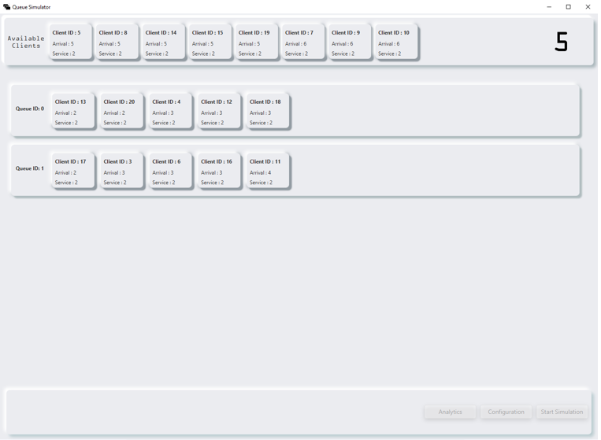

## Simulation Application for Analyzing Queuing-based Systems

### Assignment Objective
Design and implement a simulation application to analyze queuing-based systems and minimize clients' waiting time. The application should allow configurable environments with adjustable queue numbers and generate customers based on their shopping completion time and payment duration. Optionally, the application should provide a user interface for real-time simulation configuration and visualization.

### Problem Analysis and Modeling
- Queues are used in real-world applications to improve efficiency by serving multiple customers with limited resources.
- The problem is determining the optimal number of queues to minimize customer waiting time while avoiding inefficiency.
- The simulation program simulates a queuing environment by altering parameters such as the number of customers, number of queues, and arrival time.
- The simulation helps decide the number of queues required for efficient customer service.

### Design Overview
#### Class Design Decisions
- The application follows the Model-View-Controller (MVC) design pattern.
- Model: Represents the application's dynamic data structures (e.g., Client, Settings).
- View: Renders the user interface using JavaFX and FXML files.
- Controller: Manages UI components, program flow, and algorithms.

#### User Interface (UI)
- The UI allows users to configure simulation options, start the simulation, and view real-time changes.
- JavaFX with FXML and CSS is used to create an intuitive and visually appealing UI.

### Implementation
#### Backend
- SimulationController: Runs the main simulation, generates clients, dispatches them to queues, and updates the UI.
- Scheduler: Generates and manages queues (Server objects) and selects the appropriate strategy for client dispatch.
- Server: Represents a queue and services clients sequentially.
- ConcreteStrategyQueue: Strategy class that sends clients to the queue with the least number of waiting customers.
- ConcreteStrategyTime: Strategy class that sends clients to the queue with the shortest waiting time.

#### Frontend
- ViewController: Manages the main view and UI functionality.
- ConfigDialog: Handles the configuration dialog and saving settings.
- AnalyticsDialog: Manages the analytics dialog and displays calculated average wait time.
- QueueComponent: Controls a single queue component in the UI.
- ClientComponent: Controls a single client component in the UI.

### User Interface (Example Image)

### Conclusion
This project focused on analyzing queuing-based systems and minimizing customer waiting time. It provided hands-on experience with Java multithreading, safe practices, and JavaFX UI development. The simulation application successfully implemented configurable environments, real-time visualization, and analytics for queuing-based systems.
